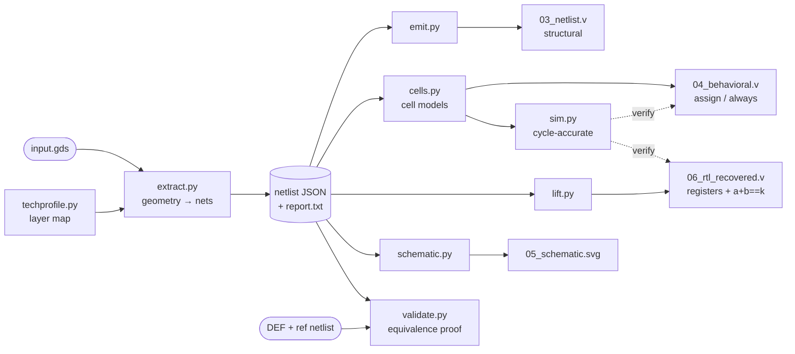
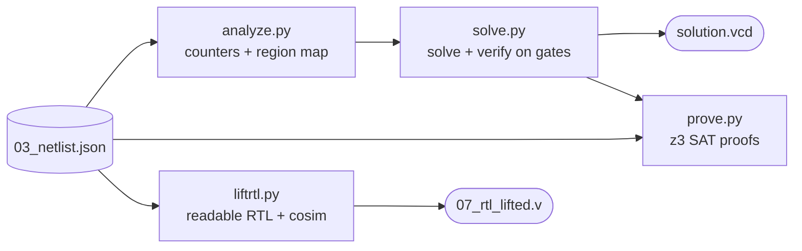

# gds2v — reverse-engineering an ASIC from its layout

> **Note: the solution code described in this writeup will be uploaded to this GitHub
> repository after the submission deadline (September 4, 2026), per the puzzle's
> no-spoilers rule.** Until then, links to source files below may not resolve; the
> writeup is self-contained — everything needed to follow the solution, including the
> answer, is on this page.

This is the writeup for our solution to the
[Jane Street ASIC puzzle](https://blog.janestreet.com/can-you-reverse-engineer-an-asic/):
a **decompiler for chips** that takes the finished layout (`puzzle.gds` — literally the
polygon geometry that would be etched into silicon, with no netlist, no names, no source)
and recovers, in order:

1. a **gate-level netlist** — which logic gate connects to which
2. **simulatable Verilog** — the recovered design runs in any hardware simulator
3. **lifted, readable RTL** — registers, counters, the actual rules the chip checks
4. the **puzzle's answer** — solved from the recovered rules, verified on the gates,
   and **proven by SAT to be the only one of the 2^121 possible inputs that works**
   (under the chip's loading protocol — the scope is stated precisely below)

The extractor is not puzzle-specific: it works on any valid GDS, degrades honestly when
full recovery is impossible, and reproduces the published netlist and RTL of a real
third-party chip as a regression. The repo root carries Jane Street's puzzle files
unmodified; everything under `tools/out/` is regenerated by the commands below, and
[`../SOLUTION.md`](../SOLUTION.md) holds the deeper layout notes and the full
easter-egg list.

---

## The answer

The chip is an **11×11 Star Battle ("Two Not Touch") checker**. Feeding it this
121-bit grid (row-major, one bit per clock) drives `success` high:

```
0000000101010000100000000000010101010000000000001010000001000001000000100000101000010000000100000010000010010001010000000
```

```
. . . . . . . * . * .
* . . . . * . . . . .
. . . . . . . * . * .
* . * . . . . . . . .
. . . . * . * . . . .
. . * . . . . . * . .
. . . . * . . . . . *
. * . . . . * . . . .
. . . * . . . . . . *
. . . . . * . . * . .
. * . * . . . . . . .
```

and the chip answers with the string — our submitted answer — spelled out one ASCII
character per clock on `O[7:0]`:

```
(* TWO STARS *)
```

(the winning message is an OCaml comment — OCaml being Jane Street's house language).
Here it is on
the recovered region map — the unique solution, found by exhaustive search and proven
unique against the silicon itself by SAT:


A waveform in `example_inputs.vcd`'s exact format and timing
(`tools/out/puzzle/solution.vcd`, regenerated by the commands below) reproduces it.

---

## Hardware, in software terms

If you write C/C++/Python but not Verilog, this mental model is all you need. A
synchronous digital chip is this program:

```c
state_t state = RESET_VALUES;          // every bit lives in a "flip-flop" (a 1-bit register)
while (1) {                            // one iteration per clock tick — always exactly one
    outputs = pure_function(state, inputs);   // "combinational logic": stateless gate network
    state   = next_state(state, inputs);      // all registers update TOGETHER at the tick
}
```

The jargon used below, translated once:

| term | closest software concept |
|---|---|
| **GDS** | the chip's *Gerber files*: per-layer photomask polygons, no netlist — below machine code |
| **standard cell** | one opcode from a fixed vendor library (`nand2`, `dfrtp` = D flip-flop, …) |
| **sky130 / PDK** | the SkyWater 130 nm open-source process; a PDK (process design kit) is its SDK — this matters because sky130's cell names are public and encode each cell's function |
| **net** | one electrical wire: a connected component of metal polygons; an edge in the circuit graph |
| **netlist** | the disassembly: every gate instance + every wire between them |
| **flip-flop ("flop")** | a 1-bit variable in the state struct, updated only at the clock tick |
| **RTL / Verilog** | the C of hardware: `always @(posedge clk)` = the tick handler, `assign` = a pure expression |
| **synthesis** | the RTL→gates compiler; like `-O3` + `strip`, it destroys all names and structure |
| **DEF / LEF / Liberty** | vendor data files: placements-with-names / cell footprints / cell functions |
| **VCD** | a logic-analyzer capture: every signal's value at every timestamp |
| **blackbox** | a cell whose connectivity is known but whose function could not be decoded |
| **miter** | XOR two circuit variants and ask a SAT solver for any input that makes them differ; UNSAT = provably identical |

## The chip's interface

The top-level metal carries text labels, so the port names are recoverable exactly;
`example_inputs.vcd` (two failed attempts, shipped with the puzzle) shows how they are
driven. Together they establish the protocol:

| port | role |
|---|---|
| `clk` | clock, 10 ns period in the reference traces |
| `rst_n` | active-low reset — the blog says to toggle it before each attempt |
| `enable` | while high, one grid bit is consumed per clock |
| `I` | serial data in: the 121 grid bits, row-major |
| `O[7:0]` | ASCII out: one character per clock once loading completes |
| `success` | the goal: latches high, with the first message character, iff the grid is a valid solution |

**Protocol**: hold `rst_n` low a few cycles, release it, then present 121 consecutive
bits on `I` with `enable` high (the reference trace inserts one idle cycle between
reset release and the first bit). The message starts **the cycle after the last input
bit** — up to 15 characters, one per clock, then zeros.

---

## The approach, step by step

### 1. Extract the netlist from bare geometry

A GDS is to a chip what Gerber files are to a PCB: per-layer metal polygons plus via
locations, and *no netlist*. Reconstructing the schematic means computing which metal
islands are electrically connected, then checking which component pins land on which
island.

Normally, knowing where each cell's pins sit requires the vendor's LEF/Liberty files.
These layouts hand us a shortcut: **every standard cell carries its pin *names* as text
labels inside its own geometry** (in sky130, on the li1/met1 label layers). Each pin is
a probe point — a coordinate with a known name — so extraction is purely geometric:

```
  1. INVENTORY    record every cell placement: type + position + rotation/mirror
  2. FLATTEN      push every cell's geometry through its transform into one
                  absolute coordinate space
  3. CONNECT      flood-fill touching metal across the six conductor layers
                  (vias join adjacent layers); each island = one wire ("net")
  4. PROBE        transform each placed cell's pin-label point, then ask which
                  island contains it -> (instance, pin, net)
  5. NAME PORTS   top-level labels (clk, rst_n, enable, I, O[7:0], success)
                  name their islands
```

Division of labour: steps 1–2 and the label transforms are our code on **gdstk**; step 3
is **KLayout's `LayoutToNetlist`** engine, fed our layer stack (a built-in sky130
layer/datatype map, or geometric auto-detection for unknown processes); step 4 queries
KLayout's net partition point-by-point (`probe_net`); step 5 is ours. One probe,
concretely:

```
  instance #17: NAND2 placed at (100, 50)
      label "Y" at local (2.1, 0.8)  →  global (102.1, 50.8)  →  inside island #42
  instance #23: DFF placed at (140, 50)
      label "D" at local (0.9, 1.1)  →  global (140.9, 51.1)  →  inside island #42
  ⇒ gate 17's output drives flip-flop 23's D input — one edge of the netlist graph
```

Repeat for all ~6,000 pin labels and the full circuit graph falls out. Internal wire
names are gone forever (stripped, like a binary without symbols); the external ports
keep their real names. On `puzzle.gds` this yields **1,618 placements, 728 logic
instances, 741 nets, 92 flip-flops, 0 unresolved pins, 0 blackboxes**.

Cells are identified as standard cells by being leaf cells that carry pin labels — not
by any name prefix — so this works for any library.

> **The subtle trap that cost hours.** `LayoutToNetlist.connect(a, b)` declares
> *inter*-layer connectivity only; `connect(a)` — one argument — declares *intra*-layer
> connectivity. Omit the latter and touching polygons on the *same* layer stay separate
> nets, silently fragmenting the extraction (172 nets instead of 84 on the warmup).

### 2. Model the cells from their names alone

What each gate *does* is decoded from the sky130 naming grammar — no PDK files needed,
because the names are systematic:

- `sky130_fd_sc_hd__nand2_1` → 2-input NAND; `inv`, `buf`, `and`, `or`, `xor`, `xnor`,
  `mux2` likewise, with the digit giving the input count;
- compound gates parse positionally: `a21oi` = **A**ND-**O**R-**I**nverted with input
  groups of **2** and **1**, i.e. `Y = ~((A1 & A2) | B1)`; `o221a` = `(A1|A2) & (B1|B2)
  & C1`; a trailing `_N` inverts;
- flops parse as `df` + feature letters: `dfrtp` = D flop with active-low async
  **R**ESET_B, `dfstp` = async SET_B, `dfxtp` = no set/reset (power-up state
  arbitrary);
- `conb` = constant driver, `dlygate`/`clkbuf`/`dlymetal` = timing buffers (identity),
  `decap`/`tap`/`fill` = physically-only cells with no logic.

Two honesty notes. First, the derived **pin inventories** are cross-checked against the
pins actually observed in the GDS for all 69 cell types used — that catches wrong
arities but does not by itself validate *functions*; the functions are validated in
aggregate by the ground-truth replays below (and independently by Icarus Verilog).
Second, on an unfamiliar library this grammar knows nothing; connectivity still
extracts and cells become blackboxes (see [limits](#any-valid-gds-and-the-honest-limits)).

### 3. Simulate — and validate against ground truth before trusting anything

`gds2v/sim.py` is a cycle-accurate emulator for the recovered netlist (topological
evaluation, flop capture with async set/reset, numpy-parallel across many stimuli).
Two ground truths validate the whole chain before any puzzle work:

- **The warmup design** ships with its source, netlist, DEF and GDS. Our extraction of
  `warmup/04_final.gds` matches the vendor netlist **exactly up to renaming**: 230/230
  instances mapped to DEF coordinates, net partition identical — and the recovered RTL,
  two 8-bit shift registers feeding `a + b == 496`, is proven equivalent to the
  original source exhaustively over all 2^16 register states.
- **The decisive check**: replaying `example_inputs.vcd` through the extracted *puzzle*
  netlist reproduces all **312 cycles of `O[7:0]` and `success` with 0 mismatches**,
  emitting `TRY AGAINTRY AGAIN`. That validates extraction, cell models and simulator
  on the real design, not just the warmup.

### 4. Identify the design

With a trustworthy netlist, `puzzle/analyze.py` recovers structure. The flop dependency
graph (92 flops) decomposes by its strongly-connected components — SCCs, groups of
flops that feed each other and therefore act as one state machine:

- an **input shift register** fed by `I`, a dozen-odd stages deep;
- a 9-flop cluster implementing a **popcount** (total star count);
- **twenty-three 2-flop counters**: these turn out to be eleven column counters,
  eleven region counters, and row/bit position bookkeeping.

The *roles* come from a simple experiment: simulate all **121 one-hot inputs** (grids
with exactly one bit set) and watch which counter increments for which cell. Eleven
counters fire for exactly the 11 cells of one column each — column counters. Eleven
more fire for irregular, orthogonally-connected blobs of cells — **region counters**,
and the blobs *are* the region map, read out of the silicon:

```
A A A A A B B C D D E        A 14   B 21   C  7
A A F A A B C C D D E        D  5   E 28   F  8
A A F B B B B C C D E        G 11   H  9   I  6
A A F B G G G E C C E        J  8   K  4
F A F B G E E E E E E
F F F B G G G E H H H        11 regions, all orthogonally connected,
B B B B B B G E H I I        covering all 121 cells with no overlaps
B J J J G G G E H I I
B J J K E E E E H I I
B B J K K E E E H H H
B J J K E E E E E E E
```

The map is not stored in the chip as a table — it is a flop-free combinational decoder
block (bottom-right of the die) driven by the position counters. Rows need no counter
bank at all: the bits stream in row-major order, so the row rule is enforced on the
fly as each row passes, and the shift register holds just over one row of history —
exactly the window needed to compare each incoming bit against its left neighbour and
the three cells above it for the adjacency rule.

The floorplan told the same story before any of this was proven — dataflow runs left
to right, and the placement clusters by function:


So the rule set is: exactly 2 stars per row, per column, and per region of the
11-region map;
no two stars touching, even diagonally; 22 stars total. That is precisely **Star
Battle**, published in newspapers as **"Two Not Touch"** — an identification the chip
itself later confirmed in its own words (the near-miss message below), and which the
puzzle's example stimulus had hinted at all along: its two failed attempts, decoded as
11-bit ASCII frames, spell ***"The night sky awaits"***.

### 5. Solve, verify, prove

`puzzle/solve.py` exhaustively solves the Star Battle over the recovered map —
**exactly one solution exists** — then verifies it where it counts: on the gate
netlist, `success` goes high and the winning message plays, while **all 121 single-bit
perturbations fail**. Simulating the two obvious degenerate grids turned up two more
messages (`BIG BANG` for all ones, `EMPTY SKY` for all zeros), and a constructed
near-miss (all counts right, two stars touching) exercised the fifth.

`puzzle/prove.py` then goes beyond testing. The netlist is unrolled symbolically —
z3 boolean expressions flowing through the *same* simulator code path the VCD replay
validated (`gds2v/symsim.py` adds no second model of the circuit) — over the full
protocol: 3 reset cycles, 121 input cycles, 24 idle cycles = 148 cycles, 144 symbolic
output samples. Building both floating-net polarities takes ~3 s and the entire proof
suite runs in **~45 s**, tractable because everything not depending on a symbolic
input constant-folds away. z3 then proves, over **all 2^121 inputs**:

| proof | result |
|---|---|
| the answer is the **only** input that ever raises `success` (block it → UNSAT) | ✔ |
| the chip emits **exactly five** messages, ever (enumerate windows until UNSAT) | ✔ |
| `BIG BANG` / `EMPTY SKY` require the exact all-ones / all-zeros grids (both floating-net polarities) | ✔ |
| `success` is independent of the floating net n293 (miter UNSAT; n293 explained below) | ✔ |
| `success` and the message window are independent of the 4 reset-less flops' power-up state | ✔ |
| **the circuit IS the recovered rules**: `success` XOR "valid Star Battle on the recovered map" is UNSAT — certifying the region map against the silicon in both directions | ✔ |
| the flop state reaches a **fixed point** within the idle tail, so the 148-cycle bound covers unbounded time | ✔ |
| the reference trace's protocol variant (one idle cycle after reset) is **equivalent**: same success set, same message window | ✔ |

**Scope, stated precisely**: these proofs quantify over every input grid, both
polarities of the floating net, and every power-up state of the reset-less flops,
under the loading protocol above (including its proven one-idle-cycle variant).
Behaviour under other stimulus patterns — `enable` gaps mid-stream, mid-stream resets,
back-to-back attempts — is validated empirically rather than proven: the reference
VCD's two consecutive attempts replay with 0 mismatches. One subtlety worth admitting:
output samples that constant-fold to a fixed value carry no z3 term and silently
vanish from SAT queries, so we separately prove every folded `success` sample is 0 —
a folded 1 would have been an input-independent win the queries could never see.

The uniqueness proof does not even depend on the Star Battle interpretation being
right: the circuit accepts this input and no other, full stop.

Finally `puzzle/liftrtl.py` machine-generates `07_rtl_lifted.v` — the complete readable
design (~215 lines: grid loader, counting over the proven region map, adjacency check,
outcome classification, message playback), with the message ROM bytes and timing
*measured* from the netlist, not assumed — and co-simulates it **cycle-for-cycle
against the gate netlist** on 2,125 grids / 348,500 cycles with 0 mismatches. As a
final independent check, **Icarus Verilog** (a third-party simulator, compiling our
emitted Verilog with our emitted cell models) runs the structural netlist, the
de-synthesised RTL (`04_behavioral.v`) and the lifted RTL (`07_rtl_lifted.v`): all
three raise `success` and print the winning message.

### What the chip says

| condition | message on `O[7:0]` |
|---|---|
| valid solution | `(* TWO STARS *)` |
| counts all correct but stars touch | `TWO"NOT TOUCH` * |
| all 121 bits set | `BIG BANG` |
| all 121 bits clear | `EMPTY SKY` |
| anything else | `TRY AGAIN` |

(*) The near-miss message is the puzzle's other published name, "Two Not Touch", with
one corrupted character — and the corruption is *physical*: it rides net 293, a
genuinely floating wire (complete routing, two gate inputs, **no driver anywhere** —
an uninitialised variable, in silicon). The net touches a different character position
per polarity: the silicon says `TWO"NOT TOUCH` (net at 0) or `TWO NOT TOUCJ` (net at
1); the clean spelling is proven unreachable at either polarity, and the SAT miter
proves `success` cannot depend on the net at all. More planted details — the example VCD is timestamped at the 2016
leap second, its `$version` string teases the reader, the warmup constant 496 is a
perfect number, and the die carries a met2 bitmap of the Jane Street logo — are
catalogued in [`../SOLUTION.md`](../SOLUTION.md).

### Problems we ran into

- **The intra-layer `connect()` trap** (step 1 above): same-layer touching polygons
  silently fragmenting into separate nets — found by counting nets against the warmup
  ground truth, 172 vs 84.
- **The floating net chase.** Net 293 initially looked like an extraction bug. Ruling
  that out took real work: every pin label resolves, no net has two drivers, the
  nearest other net is 200 nm away on every layer — it is a property of the layout.
  The regression now *asserts* exactly one floating net, and the SAT miter proves it
  can corrupt one message character but never `success`.
- **Machine-specific environment traps** (documented in Setup for reproducers on
  similar machines): a shell profile that put MinGW DLLs on `PATH` made numpy segfault
  on import, and an embedded-toolchain Python broke `ctypes` so KLayout couldn't load.
  Neither has anything to do with the puzzle; both cost debugging time anyway.
- **Fill-dominated flattening.** On layouts where decap/tap/fill dominate (the
  third-party regression chip: 487k placements of which ~486k are fill), flattening
  everything is the bottleneck; pruning physical-only cells *before* flattening cut
  extraction from 88 s to 4 s with a bit-identical net partition.

---

## The toolchain

The reusable core (`gds2v/`):



The puzzle application (`puzzle/`), built on it:



Dotted arrows are self-checks: decompiler output is only trusted after it runs
cycle-for-cycle identically to the disassembly it came from.

### Project layout

```
tools/
├── pyproject.toml          installable package (gds2v + puzzle); pins the dependencies
├── requirements.txt        one line: `-e .` (editable install of the above)
├── gds2v/                  CORE LIBRARY — GDS → Verilog, reusable and PDK-agnostic
│   ├── __main__.py           the `python -m gds2v` CLI
│   ├── extract.py            geometry → cells + nets  (+ capability report)
│   ├── techprofile.py        layer-map profiles: built-in sky130 + auto-detect
│   ├── cells.py              cell-name grammar → boolean / register models
│   ├── llmassist.py          opt-in LLM fallback for unknown libraries
│   ├── emit.py               netlist naming → JSON / structural / behavioural Verilog
│   ├── sim.py                the emulator: cycle-accurate, numpy-parallel
│   ├── symsim.py             the same emulator over z3 booleans (symbolic execution)
│   ├── lift.py               shift-register + word-level structure recovery
│   ├── schematic.py          gate-symbol SVG renderer
│   ├── validate.py           equivalence check vs a DEF + reference netlist
│   └── paths.py              one source of truth for every data path
├── puzzle/                 APPLICATION — the Star Battle solver, built on gds2v
│   ├── analyze.py            recover the state machine / counters / region map
│   ├── solve.py              solve, verify on the netlist, write solution.vcd
│   ├── prove.py              SAT proofs (uniqueness, completeness, closures)
│   ├── liftrtl.py            emit 07_rtl_lifted.v + cycle-exact cosim
│   ├── visualize.py          floorplan / region / logo figures
│   └── vcdtool.py            read + write the puzzle's VCD traces
├── tests/                  ALL tests + fixtures (test_regression.py runs everything)
├── figures/                the figures embedded in this writeup
└── out/                    all generated output (gitignored)
```

### Setup

Requires **CPython 3.12**:

```powershell
py -3.12 -m venv .venv
.\.venv\Scripts\python.exe -m pip install -r requirements.txt   # editable install of gds2v + puzzle
.\.venv\Scripts\python.exe tests\test_regression.py             # ~5 min; expect "64/64 checks passed"
```

(A fresh run reports **64/64**. Two opt-in suites add checks when their prerequisites
exist: the third-party Caravel suite after fetching its ~160 MB fixtures with
`python tests\fetch_opensource.py`, and the Icarus Verilog cross-check when an
`iverilog` executable is found — **66/66** with both.)

| package | used for |
|---|---|
| `klayout` | `LayoutToNetlist` connectivity extraction (gdstk cannot do this) |
| `gdstk` | fast GDS reads: placements, polygons, cell census |
| `numpy` | bit-parallel simulation, one lane per stimulus |
| `vcdvcd` | VCD parsing |
| `networkx` | register dependency graph, SCCs, logic cones, topological sort |
| `matplotlib` | schematic and placement figures |
| `z3-solver` | the SAT proofs |
| `anthropic` *(optional extra)* | the `--llm-assist` fallback only — `pip install -e .[llm]` |

> **Two environment traps specific to this development machine** (recorded in case a
> reproducer hits something similar):
> - **Run from PowerShell, not the Bash/MSYS shell.** That shell's profile loads an
>   embedded-SDK env whose MinGW DLLs collide with numpy's OpenBLAS on `PATH` —
>   `import numpy` segfaults outright.
> - **Do not use an embedded-toolchain Python.** Its `ctypes` fails to initialise, so
>   `klayout`/`gdstk` cannot load there. The venv above sidesteps both.

### Reproduce the whole solution

```powershell
.\.venv\Scripts\python.exe -m gds2v ..\puzzle.gds -o out\puzzle   # steps 1-2: extract + emit
.\.venv\Scripts\python.exe -m puzzle.analyze                      # step 4: structure + region map
.\.venv\Scripts\python.exe -m puzzle.solve                        # step 5: solve, verify, solution.vcd
.\.venv\Scripts\python.exe -m puzzle.prove                        # step 5: the SAT proofs
.\.venv\Scripts\python.exe -m puzzle.liftrtl                      # readable RTL + cosim
.\.venv\Scripts\python.exe tests\test_regression.py               # all of the above, plus the
                                                                  # step-3 ground-truth checks: 64/64
```

### The CLI, for any GDS

```powershell
.\.venv\Scripts\python.exe -m gds2v <input.gds> -o <outdir> [options]
```

| option | meaning |
|---|---|
| `--profile sky130 \| auto` | technology profile; default = match a built-in, else auto-detect |
| `--top <name>` | choose the top cell when a GDS has several |
| `--prune-fill` | drop decap/tap/fill before extraction (needed for fill-dominated dies) |
| `--cone <port>` | also draw the logic cone of one output as a separate schematic |
| `--def D.def --ref R.v` | validate the result against a DEF + reference netlist |
| `-m, --module <name>` | override the emitted module name (default = top cell) |
| `--power` | include `VPWR`/`VGND` connections in the emitted Verilog |
| `--llm-assist` | opt-in fallback for unknown cell libraries (below) |
| `--no-schematic`, `-q` | skip the SVG / quiet mode |

Outputs, in decompiler order — each file one step further from polygons:

| file | contents | software analogue |
|---|---|---|
| `report.txt` | capability report: technology, counts, which stages ran | the loader's verdict |
| `01_cells.json` / `02_nets.json` | placed cells / nets with terminals | symbol + cross-reference tables |
| `03_netlist.json` / `03_netlist.v` | canonical netlist / structural Verilog | the IR / assembly listing |
| `04_behavioral.v` | de-synthesised RTL: one `assign` per gate † | line-per-instruction decompile |
| `05_schematic.svg` | circuit diagram, IEEE gate symbols | control-flow graph render |
| `06_rtl_recovered.v` | lifted RTL: registers + proven word-level functions † | readable decompiled source |
| `cells_sim.v` | behavioural models for every cell type used † | the recovered "libc" |

† needs every cell's *function* known (recognised library); skipped with a reason
otherwise, while `03_netlist.v` and the schematic still come from connectivity alone.

---

## Any valid GDS, and the honest limits

The extractor never crashes on a valid file and never claims more than it proved.
Synthetic stress files (unknown layer stacks, nested hierarchy, AREF arrays, multiple
tops, no labels, empty files) are handled or degraded honestly with a reason in the
capability report — that's `tests/test_generality.py`. Stated plainly:

- **No pin labels → no pins (in this tool).** If labels were stripped but cell geometry
  remains, recovery is possible one level down (transistor extraction, as LVS tools do);
  we deliberately stop at the metal stack and report the limit. If the GDS ships
  abstract cells whose pins live only in the vendor LEF, the information is absent from
  the file itself.
- **Unknown library → no proven functions.** Connectivity still extracts; cells stay
  blackbox. The opt-in `--llm-assist` flag can close part of this gap: a Claude model
  proposes each cell's function from its name and observed pins, but the LLM is a
  **hypothesis generator, never a source of truth** — a proposal enters the netlist
  only after deterministic verification (pin set must match the GDS exactly, single
  combinational output, expression parses), and everything built on it is labelled a
  hypothesis. Off by default; without the flag no LLM code runs and no network
  connection is ever made. Nothing the regression proves involves an LLM.
- **Names are never recoverable.** Synthesis is many-to-one; equivalence *up to
  renaming* is the strongest true claim — the same limit any decompiler has.
- **FPGAs are out of scope** — an FPGA bitstream configures fixed silicon; there is no
  GDS of *your* logic to reverse.

**Third-party regression.** The extractor reproduces the Efabless **Caravel**
`user_proj_example` macro (a 16-bit wishbone counter; 487k placements including fill)
from its published GDS: the recovered net partition is identical to the published
gate-level netlist over every signal pin, and the recovered logic co-simulates
cycle-for-cycle against the published RTL. With `--prune-fill`, extraction runs in 4 s
instead of 88 s (22×) with a bit-identical partition — fill/tap/decap touch only the
supply rails, which is the premise of pruning them.

## Testing

```powershell
.\.venv\Scripts\python.exe tests\test_regression.py -v   # ~5 min → 64/64 (+2 opt-in: Caravel, iverilog → 66/66)
```

| suite | proves |
|---|---|
| `tests/test_warmup.py` | GDS → netlist/RTL matches all four warmup reference files (22 checks) |
| `tests/test_behavioral.py` | emitted `04_behavioral.v` *text* re-parses and co-simulates identically |
| `tests/test_generality.py` | arbitrary-GDS handling / honest degradation (14 checks) |
| `tests/test_llmassist.py` | LLM-assist verification gate admits/rejects proposals correctly (18 checks, fake transport — no network) |
| `tests/test_opensource.py` | Caravel: netlist partition + RTL behaviour match the published files |
| `tests/test_iverilog.py` | every emitted puzzle RTL passes under Icarus Verilog (opt-in) |

## Notes on `puzzle.gds`

- **Net 293 is genuinely floating** — see the near-miss discussion above. The
  regression asserts exactly one such net.
- **15 `clkbuf_4` cells have unloaded outputs** — clock-tree balancing dummies. The tree
  is coherent: `clk` → one `clkbuf_16` → 16 `clkbuf_8` → 16 leaf nets carrying all 92
  flip-flops.
- **The spiral is decoration** — a 57×57 met2 bitmap of Jane Street's logo,
  electrically isolated: no vias, no cells, routing detours around it. No payload.

  

- **36 `INTERNAL_*` placeholders** sit in one row below the die — anonymisation
  leftovers with no real geometry.

The full easter-egg catalogue — the leap-second timestamp, the `$version` tease, the
perfect number in the warmup, the hint decoding — is in
[`../SOLUTION.md`](../SOLUTION.md).
