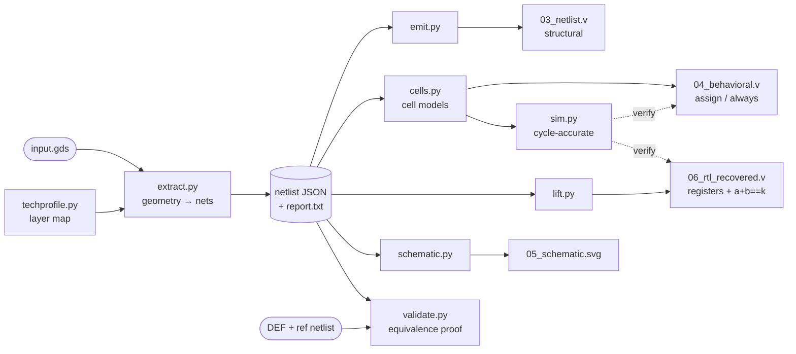

# gds2v — a decompiler for chips

This directory takes a finished chip layout (a `.gds` file — literally the polygon
geometry that would be etched into silicon, with no netlist and no source code) and
reverse-engineers it the way you'd reverse a stripped binary, recovering in order:

1. a **gate-level netlist** — which logic gate connects to which (≈ the *disassembly*);
2. **simulatable Verilog** — so the recovered design runs in any hardware simulator
   (≈ a runnable *emulator model*);
3. **de-synthesised RTL** — the same logic as one statement per gate (≈ raw,
   line-per-instruction *decompiler output*);
4. **lifted RTL** — recovered *structure*: registers, shift chains, `a + b == constant`
   (≈ readable *decompiled source*);
5. a **gate-symbol schematic** (SVG) — the circuit diagram;
6. a **capability report** stating exactly what was and was not recovered.

It is built to solve the [Jane Street ASIC puzzle](https://blog.janestreet.com/can-you-reverse-engineer-an-asic/)
(that answer is in [`../SOLUTION.md`](../SOLUTION.md)), but the extractor is not
puzzle-specific: it works on **any valid GDS**, and where full recovery is impossible it
degrades honestly instead of guessing. It reproduces the published netlist and RTL of a
real third-party chip (Efabless Caravel) as a regression.

Nothing here is puzzle data; the repo root stays source-data-only.

---

## Hardware, in software terms

If you write C/C++/Python but not Verilog, this mental model is all you need. A
synchronous digital chip is this program:

```c
state_t state = RESET_VALUES;          // every bit lives in a "flip-flop" (a 1-bit register)
while (1) {                            // one iteration per clock tick — always exactly one
    outputs = pure_function(state, inputs);   // "combinational logic": stateless gate network
    state   = next_state(state, inputs);      // all registers update TOGETHER at the tick
}
```

The loop body isn't executed instruction-by-instruction — all gates evaluate
*concurrently and continuously* as signals ripple through them, and the clock edge is a
sample strobe that commits every register's pending value at once (double buffering:
new state is computed from old state, then the swap is atomic). One loop iteration
always costs exactly one clock cycle; what limits the clock speed is the deepest chain
of gates that must settle between ticks (the "critical path").

The jargon used in this README, translated once:

| chip term | closest software concept |
|---|---|
| **GDS** | the chip's *Gerber files*: per-layer photomask polygons, no netlist — below machine code |
| **standard cell** | one opcode/intrinsic from a fixed vendor library (`nand2`, `dfrtp` = D flip-flop, …); its definition is the *footprint drawing* |
| **net** | one electrical wire = a *copper island*: a connected component of metal polygons; an edge in the circuit graph |
| **via** | the chip's PCB-via: a metal plug that makes layer N touch layer N+1 |
| **netlist** | the disassembly: every gate instance + every wire between them |
| **flip-flop ("flop")** | a 1-bit variable in the state struct, updated only at the clock tick |
| **combinational logic** | the pure, stateless expressions between the state variables |
| **RTL / Verilog** | the C of hardware: `always @(posedge clk)` = the tick handler, `assign` = a pure expression |
| **synthesis** | the RTL→gates compiler; like `-O3` + `strip`, it destroys all names and structure |
| **place & route** | the linker: assigns each gate a coordinate and draws the wires |
| **PDK / LEF / Liberty** | the vendor BSP: databases of each cell's geometry, pins and function |
| **DEF** | the linker map file: names + placements + routing, before stripping |
| **VCD** | a logic-analyzer capture: every signal's value at every timestamp |

The tool's own components map the same way: `sim.py` is an *emulator* for the recovered
netlist, `symsim.py` runs that same emulator over symbolic values (*symbolic execution*,
à la KLEE/angr — but exhaustive, since an unrolled circuit is a finite formula), and the
RTL emitters are the *decompiler back-end*.

---

## The one idea that makes it work

**A GDS is to a chip what Gerber files are to a PCB**: per-layer copper polygons plus
via locations, and *no netlist*. So the task is one you may know from board bring-up:
*given only the Gerbers and each component's footprint drawing, reconstruct the
schematic*. On a PCB you would compute which copper islands are connected, then check
which component pins land on which island. That is exactly what the extractor does —
standard cells are the components, and their pin labels are the footprint pinout.

Normally, knowing where each cell's pins sit requires the vendor's cell database
(LEF/Liberty — the "BSP"). These layouts hand us a shortcut: **every standard cell
carries its pin *names* as text labels inside its own geometry** (in sky130, on the
li1/met1 label layers). Each pin is a *probe point* — a coordinate with a known name —
so extraction is purely geometric, no vendor data needed:

```
        cell definition in the GDS                 what we read out
        ┌───────────────────────┐
        │  ▓ "A"      ▓ "Y"      │   pin label "A" at (x1,y1)  ── input
        │  ▓ "B"                 │   pin label "B" at (x2,y2)  ── input
        │  "VPWR" ▔▔▔▔▔▔▔▔▔      │   pin label "Y" at (x3,y3)  ── output
        └───────────────────────┘   ("VPWR"/"VGND" = supply, ignored)
```

The flow, annotated:

```
  1. INVENTORY THE COMPONENTS   A GDS is a scene graph: cell definitions (footprint
     drawings, in local coordinates) referenced by placements.  Record every
     placement: type + position + rotation/mirror.  (The puzzle: 1,618 of them.)
  2. BAKE ONE COORDINATE SPACE  Routing lives at the top level, but pin metal lives
     inside the cell definitions.  Flatten — expand every reference through its
     transform, like inlining all calls — so every polygon has absolute coordinates.
  3. BLOB DETECTION             Touching metal is the same wire; a via is a plug that
     makes layer N touch layer N+1.  Flood-fill all polygons across the six metal
     layers into connected components.  Each island = one wire ("net").
  4. PROBE THE PINS             Push each placed cell's pin-label point through its
     placement transform, then point-in-polygon: which island contains it?  That
     island is the pin's net.
  5. NAME THE OUTSIDE WORLD     Top-level labels ("clk", "I", "O[0]", "success") sit
     on the package-pin metal; whatever island each lands on takes that name.
```

One probe, concretely:

```
  instance #17: NAND2 placed at (100, 50)
      label "Y" at local (2.1, 0.8)  →  global (102.1, 50.8)  →  inside island #42
  instance #23: DFF placed at (140, 50)
      label "D" at local (0.9, 1.1)  →  global (140.9, 51.1)  →  inside island #42
  ⇒ gate 17's output drives flip-flop 23's D input — one edge of the netlist graph
```

Repeat for all ~6,000 pin labels and the full circuit graph falls out: for every gate,
`pin → net`. Internal wire names are gone forever (stripped, like a binary without
symbols); the external ports keep their real names via step 5.

Cells are identified as standard cells by being **leaf cells that carry pin labels** — not
by any name prefix — so connectivity extracts for any library. What the *cells do* is a
separate question answered by [`cells.py`](gds2v/cells.py) from the sky130 naming grammar
(think: recovering a function's behaviour from its mangled name); an unknown library
still yields connectivity, with functions marked "blackbox".

> **The subtle trap that cost hours.** `LayoutToNetlist.connect(a, b)` declares *inter*-layer
> connectivity only. `connect(a)` — a single argument — declares *intra*-layer connectivity.
> Omit the latter and touching polygons on the *same* layer stay separate nets, silently
> fragmenting the extraction (172 nets instead of 84 on the warmup). Both are needed.

---

## Pipeline



Each box is one module in [`gds2v/`](gds2v/); the dotted arrows are the *self-checks* —
decompiler output is only trusted after it runs cycle-for-cycle identically to the
disassembly it came from.

---

## Project layout

```
tools/
├── pyproject.toml          installable package (gds2v + puzzle); pins the dependencies
├── requirements.txt        one line: `-e .` (editable install of the above)
├── gds2v/                  CORE LIBRARY — GDS → Verilog, reusable and PDK-agnostic
│   ├── __main__.py           the `python -m gds2v` CLI
│   ├── paths.py              one source of truth for every data path
│   ├── extract.py            geometry → cells + nets  (+ capability report)
│   ├── techprofile.py        layer-map profiles: built-in sky130 + auto-detect
│   ├── cells.py              cell-name grammar → boolean / register models
│   ├── emit.py               netlist naming → JSON / structural / behavioural Verilog
│   ├── sim.py                the emulator: cycle-accurate, numpy-parallel across inputs
│   ├── symsim.py             the same emulator over z3 booleans (symbolic execution)
│   ├── lift.py               shift-register + word-level structure recovery
│   ├── schematic.py          gate-symbol SVG renderer
│   └── validate.py           equivalence check vs a DEF + reference netlist
├── puzzle/                 APPLICATION — the Star Battle solver, built on gds2v
│   ├── analyze.py            recover the state machine / counters / region map
│   ├── solve.py              solve, verify on the netlist, write solution.vcd
│   ├── prove.py              SAT proofs: uniqueness, message completeness
│   ├── liftrtl.py            emit full readable RTL (07_rtl_lifted.v) + cosim
│   ├── visualize.py          floorplan / region / logo figures
│   └── vcdtool.py            read + write the puzzle's VCD traces
├── tests/                  ALL tests + fixtures
│   ├── test_regression.py    the whole pipeline, end to end (run this)
│   ├── test_{warmup,behavioral,generality,opensource,iverilog}.py
│   ├── testutil.py           shared PASS/FAIL bookkeeping
│   ├── make_test_gds.py      synthetic GDS generator (generality fixtures)
│   └── fetch_opensource.py   third-party Caravel fixture downloader
└── out/                    all generated output (gitignored)
```

---

## Setup

Requires **CPython 3.12**. One command installs the toolchain (editable) and its
dependencies from `pyproject.toml`:

```powershell
py -3.12 -m venv .venv
.\.venv\Scripts\python.exe -m pip install -r requirements.txt   # editable install of gds2v + puzzle
.\.venv\Scripts\python.exe tests\test_regression.py             # ~5 min; expect "60/60 checks passed"
```

The install makes `gds2v` and `puzzle` importable from anywhere and registers the
`python -m gds2v` CLI, so nothing depends on your current directory.

(A fresh run reports **60/60**. Two opt-in suites add checks when their prerequisites
exist: the third-party Caravel suite after fetching its ~160 MB fixtures, and the
Icarus Verilog cross-check when an `iverilog` executable is found — **62/62** with
both. See [Testing](#testing).)

| package | used for |
|---|---|
| `klayout` | `LayoutToNetlist` connectivity extraction (gdstk cannot do this) |
| `gdstk` | fast GDS reads: placements, polygons, cell census |
| `numpy` | bit-parallel simulation, one lane per stimulus |
| `vcdvcd` | VCD parsing |
| `networkx` | register dependency graph, SCCs, logic cones, topological sort |
| `matplotlib` | schematic and placement figures |
| `z3-solver` | SAT proofs: answer uniqueness, message-set completeness |

> **Two Windows environment traps (both cost real debugging time):**
> - **Run from PowerShell, not the Bash/MSYS shell.** That shell's profile loads the nRF
>   Connect SDK env, which puts MinGW DLLs on `PATH` that collide with numpy's OpenBLAS —
>   `import numpy` segfaults outright.
> - **Do not use the nRF toolchain Python** (`C:\ncs\toolchains\...`). Its `ctypes` fails to
>   initialise regardless of `PATH`, so `klayout`/`gdstk` cannot load there. The venv here
>   sidesteps both.

---

## Run it

```powershell
.\.venv\Scripts\python.exe -m gds2v <input.gds> -o <outdir> [options]
```

| option | meaning |
|---|---|
| `--profile sky130 \| auto` | technology profile; default = match a built-in, else auto-detect |
| `--top <name>` | choose the top cell when a GDS has several |
| `--prune-fill` | drop decap/tap/fill before extraction (needed for fill-dominated dies) |
| `--cone <port>` | also draw the logic cone of one output as a separate schematic |
| `--def D.def --ref R.v` | validate the result against a DEF + reference netlist |
| `-m, --module <name>` | override the emitted module name (default = top cell) |
| `--power` | include `VPWR`/`VGND` connections in the emitted Verilog |
| `--no-schematic`, `-q` | skip the SVG / quiet mode |

Outputs written to `<outdir>`, in decompiler order — each file one step further from
polygons and closer to source:

| file | contents | software analogue |
|---|---|---|
| `report.txt` | capability report — technology, hierarchy, counts, which stages ran | the loader's verdict |
| `01_cells.json` | placed cells: type, coordinates, orientation | symbol table |
| `02_nets.json` | nets and their `(instance, pin)` terminals | cross-reference table |
| `03_netlist.json` | canonical machine-readable netlist (consumed by every other stage) | the IR |
| `03_netlist.v` | **structural Verilog** — one cell instance per gate | assembly listing |
| `04_behavioral.v` | **de-synthesised RTL** — one `assign` per gate, one `always` per register † | line-per-instruction decompile |
| `05_schematic.svg` | **circuit diagram** — IEEE gate symbols, D-flop boxes, inversion bubbles | control-flow graph render |
| `06_rtl_recovered.v` | **lifted RTL** — registers + proven word-level functions † | readable decompiled source |
| `cells_sim.v` | behavioural models for every cell type used (simulation) † | the recovered "libc" |
| `extract.log` | run log | — |

† `04`, `06`, `cells_sim.v` need every cell's *function* to be known (recognised library).
On an unknown library they are skipped with a reason; `03_netlist.v` and the schematic are
still produced from connectivity alone.

---

## Worked example: recovering `a + b == 496` from a layout

The `warmup/` design is a tiny chip whose ground-truth source we know, so it makes a clean
demonstration. Its `00_source.v` is two 8-bit shift registers feeding an adder and a
`== 496` comparator — but we only feed the tool the **final GDS**:

```powershell
.\.venv\Scripts\python.exe -m gds2v ..\warmup\04_final.gds -o out\warmup
```

**`out/warmup/report.txt`** — what was recovered:

```
== gds2v capability report: ..\warmup\04_final.gds ==
  top cell        : adder_demo
  technology      : sky130
  hierarchy       : flat
  logic instances : 79 (16 known types, 0 blackbox)
  nets            : 86 (8 named from labels)
  unresolved pins : 0
  downstream stages:
    [available] structural_verilog
    [available] simulation
    [available] behavioral_verilog
    [available] lift_rtl
    [available] schematic
```

**`out/warmup/06_rtl_recovered.v`** — the tool re-derives the *design*, from the layout
alone, with the register widths, the shift semantics, and the compare constant all recovered
(and the `== 496` **proven exhaustively over all 2¹⁶ register states**):

```verilog
module adder_demo (A, B, S, clk, en, rst_n);
  input A; input B; output S; input clk; input en; input rst_n;

  reg [7:0] sr_a;   // shift register, serial input A
  reg [7:0] sr_b;   // shift register, serial input B

  always @(posedge clk or negedge rst_n)
    if (!rst_n) sr_a <= 8'b0;
    else if (en) sr_a <= {sr_a[6:0], A};

  always @(posedge clk or negedge rst_n)
    if (!rst_n) sr_b <= 8'b0;
    else if (en) sr_b <= {sr_b[6:0], B};

  assign S = ({1'b0, sr_a} + {1'b0, sr_b} == 9'd496);   // exhaustive over 2^16 states
endmodule
```

If you don't read Verilog, here is the same design as the C you'd write — the mapping
is mechanical:

```c
struct { uint8_t sr_a, sr_b; } state;          // reg [7:0] = a uint8_t held in flip-flops

void tick(bool A, bool B, bool en, bool rst_n) // always @(posedge clk ...) = the tick handler
{
    if (!rst_n)  { state.sr_a = 0; }                          // async reset branch
    else if (en) { state.sr_a = (state.sr_a << 1) | A; }      // {sr_a[6:0], A} = shift-in
    /* ...same for sr_b; in hardware BOTH commit simultaneously (double-buffered `<=`) */
}

bool S(void)                                   // assign = a pure expression, evaluated
{                                              // continuously, not on the tick
    return (uint16_t)state.sr_a + state.sr_b == 496;
}
```

Compare to the original `warmup/00_source.v`: two `shift_register`s, `assign sum = a + b`,
`assign eq = (val == 9'd496)`. Same design. The only thing not recovered is the *names*
(`sr_a` is synthesised; the original was `sr_a`/`a_reg`) — because synthesis, like an
optimising compiler plus `strip`, destroys names and module structure irreversibly. What
**is** proven is behavioural equivalence.

`test_warmup.py` grades this run against all four reference files the warmup ships:

```
.\.venv\Scripts\python.exe tests\test_warmup.py
...
22/22 checks passed
```

—placement matched to the DEF (230/230 by coordinate), net partition identical to the
gate netlist up to renaming, and the recovered logic simulated against a golden model of
`00_source.v` over every `(a,b)` summing to 495/496/497 plus random reset/enable traces.

---

## Any valid GDS: what happens, and the honest limits

The extractor never crashes on a valid file and never claims more than it proved.
`test_generality.py` drives synthetic files that each break a naïve sky130-only extractor:

| stress case | behaviour |
|---|---|
| **unknown PDK layers** | layer stack auto-detected from geometry; connectivity + structural netlist + schematic produced; functions marked **blackbox**, simulation/RTL disabled *with a reason* |
| **nested hierarchy** | descends into sub-modules (not just the top's direct children) |
| **AREF arrays** | array placements expanded to individual instances |
| **multiple top cells** | one chosen (or `--top`), the rest warned about; no crash |
| **no pin labels** | reported as "cannot recover a pin-level netlist"; no crash |
| **empty file** | reported; no crash |

**Hard limits, stated plainly:**

- **No pin labels → no pins.** Foundry GDS often ships *abstract* cells whose pin geometry
  lives in a separate LEF file (the vendor database). Without labels or LEF, connectivity
  to cell pins is unrecoverable — like disassembling with no symbol for any call target.
- **Unknown library → no functions.** Cell *function* comes from the naming grammar
  ([`cells.py`](gds2v/cells.py), sky130) or a Liberty model. An unfamiliar library still
  extracts connectivity but its cells stay blackbox — a call graph of opaque functions.
- **FPGAs are out of scope.** An FPGA design compiles to a *bitstream* configuring fixed
  silicon — there is no GDS of *your* logic to reverse. That is bitstream RE, a different
  problem.
- **Names are never recoverable.** Synthesis is many-to-one; original signal/module names
  and hierarchy are gone. Equivalence *up to renaming* is the strongest true claim — the
  same limit any decompiler has on a stripped binary.

**Performance on large layouts.** Netlist extraction runs multi-threaded, and with
`--prune-fill` the pruned cells' *geometry* is also dropped before flattening — on
fill-dominated dies that geometry is the bulk of what the extractor would chew through.
Caravel's user area (487k placements): **88 s → 4 s (22×)** with a bit-identical net
partition (verified terminal-for-terminal, and the full Caravel reference suite passes
unchanged). Signal nets cannot be affected — fill/tap/decap touch only the supply
rails, which is the premise of pruning them. Per-stage timings (flatten, connectivity,
probing) are printed on every run. A near-point probe fallback also retries labels
whose anchor sits just off the pin shape (seen in some PDK conversions); it never
fires on exact layouts.

---

## Module map

| module | responsibility |
|---|---|
| [`gds2v/extract.py`](gds2v/extract.py) | GDS → cells + nets; multi-top, hierarchy, arrays, capability report |
| [`gds2v/techprofile.py`](gds2v/techprofile.py) | layer-map profiles: built-in sky130 + geometry auto-detection |
| [`gds2v/cells.py`](gds2v/cells.py) | cell-name grammar → boolean/register models; blackbox fallback |
| [`gds2v/emit.py`](gds2v/emit.py) | netlist naming + JSON / structural / behavioural Verilog |
| [`gds2v/sim.py`](gds2v/sim.py) | the emulator: topological-sort + evaluate per tick, numpy-parallel across stimuli |
| [`gds2v/symsim.py`](gds2v/symsim.py) | the same emulator code path over z3 booleans — symbolic execution for the SAT proofs |
| [`gds2v/lift.py`](gds2v/lift.py) | shift-register + word-level structure recovery, self-verified |
| [`gds2v/schematic.py`](gds2v/schematic.py) | gate-symbol SVG renderer |
| [`gds2v/validate.py`](gds2v/validate.py) | equivalence check vs a DEF + reference netlist |

The puzzle-specific analysis (built on the core library) lives in the [`puzzle/`](puzzle/)
package, each module runnable as `python -m puzzle.<name>`:

| module | run | responsibility |
|---|---|---|
| [`puzzle/analyze.py`](puzzle/analyze.py) | `python -m puzzle.analyze` | recover the state machine / region structure |
| [`puzzle/solve.py`](puzzle/solve.py) | `python -m puzzle.solve` | solve the Star Battle, write `solution.vcd` |
| [`puzzle/prove.py`](puzzle/prove.py) | `python -m puzzle.prove` | SAT proofs: uniqueness, message-set completeness, power-up + floating-net independence, circuit ⇔ rules |
| [`puzzle/liftrtl.py`](puzzle/liftrtl.py) | `python -m puzzle.liftrtl` | emit `07_rtl_lifted.v` — full readable RTL, co-simulated cycle-for-cycle vs the netlist |
| [`puzzle/visualize.py`](puzzle/visualize.py) | `python -m puzzle.visualize` | floorplan / region / logo figures |
| [`puzzle/vcdtool.py`](puzzle/vcdtool.py) | `python -m puzzle.vcdtool <vcd>` | read + write VCD traces |

---

## Testing

```powershell
.\.venv\Scripts\python.exe tests\test_regression.py -v   # ~5 min → 60/60 (+2 opt-in: Caravel, iverilog → 62/62)
```

The regression composes the focused suites in [`tests/`](tests/), each runnable alone
(`python tests\test_warmup.py`, etc.):

| suite | proves |
|---|---|
| `tests/test_warmup.py` | GDS → netlist/RTL matches all four warmup reference files (22 checks) |
| `tests/test_behavioral.py` | emitted `04_behavioral.v` *text* re-parses and co-simulates identically |
| `tests/test_generality.py` | arbitrary-GDS handling / honest degradation (14 checks) |
| `tests/test_opensource.py` | Caravel: netlist partition + RTL behaviour match the published files |
| `tests/test_iverilog.py` | every emitted puzzle RTL passes under Icarus Verilog (opt-in) |

Shared PASS/FAIL bookkeeping is in [`tests/testutil.py`](tests/testutil.py). Fetch the
third-party fixtures once with `python tests\fetch_opensource.py` (~160 MB, git-ignored) to
enable the Caravel suite; it is skipped otherwise.

---

## Notes on `puzzle.gds` (the original target)

- **Net 293 is genuinely floating** — a wire with two gate inputs attached, complete
  routing, and no driver anywhere (an uninitialised variable, in silicon). Not an
  extraction defect: every pin resolves, no net has two drivers, the nearest other net is
  200 nm away. It reaches `O[1]`/`O[4]` but no register; its only observable effect is one
  character of the near-miss message, and `puzzle/prove.py` proves by SAT miter that
  `success` is independent of it. The regression asserts exactly one such net.
- **15 `clkbuf_4` cells have unloaded outputs** — clock-tree balancing dummies. The tree is
  coherent: `clk` → one `clkbuf_16` → 16 `clkbuf_8` → 16 leaf nets carrying all 92
  flip-flops.
- **36 `INTERNAL_*` placeholders** sit in one row below the die — anonymisation leftovers
  with no real geometry.

The full solution write-up — the Star Battle answer, region map, and verification
transcript — is in [`../SOLUTION.md`](../SOLUTION.md).
